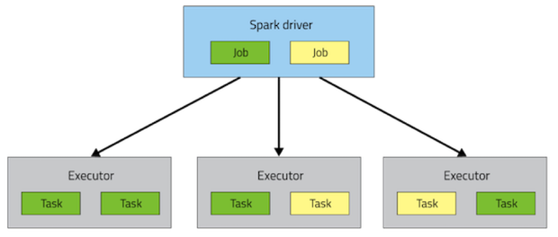

# Spark

## Spark Architecture


Configs:

```text
--num-executors: total number of executors in cluster
--executor-memory: amount of memetory per executor
--executor-cores: number of cores per executor
```

## Spark Tune





[https://blog.cloudera.com/how-to-tune-your-apache-spark-jobs-part-2/](https://blog.cloudera.com/how-to-tune-your-apache-spark-jobs-part-2/)

