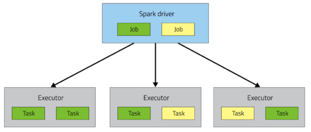

# Spark

## Spark Architecture


Configs:

```text
--num-executors: total number of executors in cluster
--executor-memory: amount of memetory per executor
--executor-cores: number of cores per executor
```

### Term relationship

* A node contain Many executors
* An executor contain Many cores
* A core runs a task
* A task runs a partition of RDD

### Skewed Join

* Join left table with rows has unskewed key
* Skewed left table, add prefix\(random between 1~10\) to join key
* Small right table, duplicate\(10\) each row and add prefix\(1~10\) to join key 
* Union unskewed join with skewed join

### Transformation vs Action

* cache\(\) is Transformation, take effect after an Action. eg. .cache\(\).count\(\)


## Spark Tune





[https://blog.cloudera.com/how-to-tune-your-apache-spark-jobs-part-2/](https://blog.cloudera.com/how-to-tune-your-apache-spark-jobs-part-2/)

