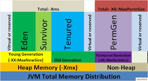

# JVM

## Memeory Model 

### heap 

* class instance, arrays
* -Xms -Xmx 
* Young gen \(1 Eden, 2 Survivor\) 
* Old gen 

### perm gen \(metadata\) 

* metadata=classes and methods defination = \(xx:PermSize, XX:MaxPermSize\) 
* Method area 
* String Pool 
* Stack memory

### Memory analysis

-verbose:gc

jmap

visualVM

### Reordering

code might be reordered at compile time

## GC

### GC Root

