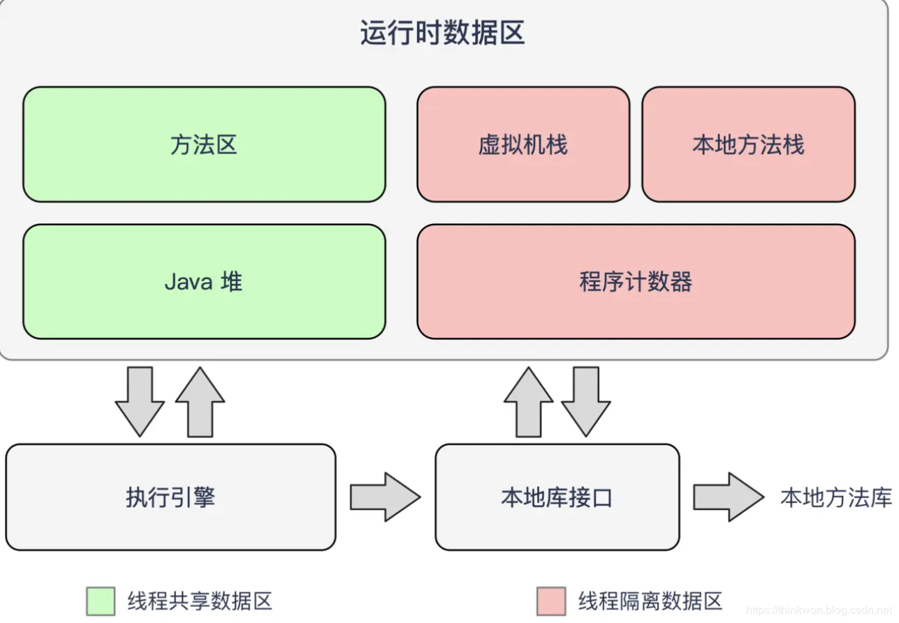

# JVM

## Memeory Model 

#### JVM Runtime memory

* 方法区
  * Pre 1.8（PermGen） = 类信息、常量池、静态变量、JIT编译后的代码
  * After 1.8 （MetaSpace），在JVM外（本地内存）；字符串常量池移到堆内
* 堆（Heap/xms&xmx）= Yong\(eden&survivor\) + Old
* 程序计数器（PC）
* 本地方法栈（Native Stack）
* 虚拟机栈（JVM Stack）

### Memory analysis

-verbose:gc

jmap

visualVM

### Reordering

code might be reordered at compile time

## GC

回收算法

* 标记-清理
* 分代回收

### GC Root

### Misc

finalize\(\): called by gc when gc

